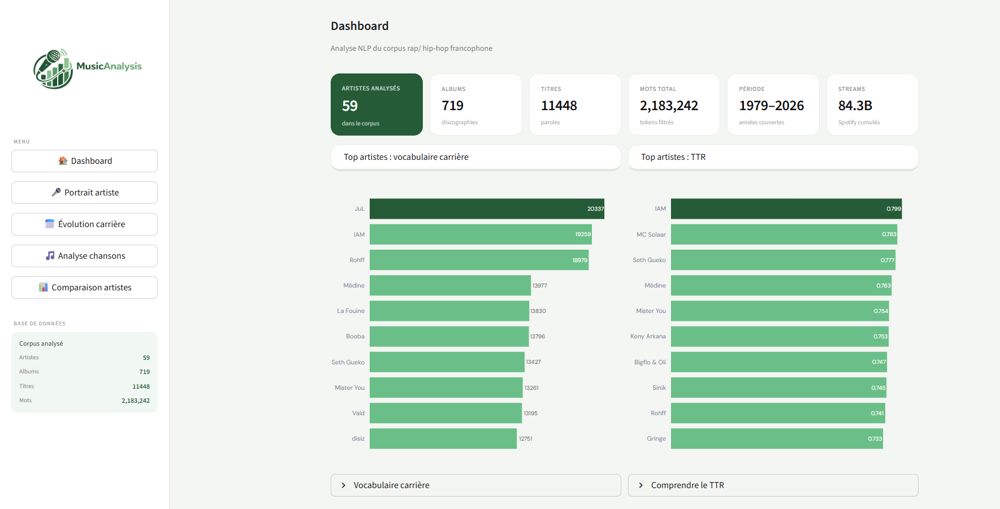
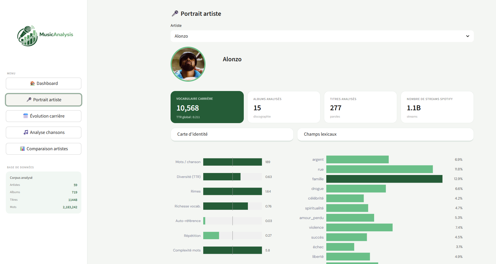
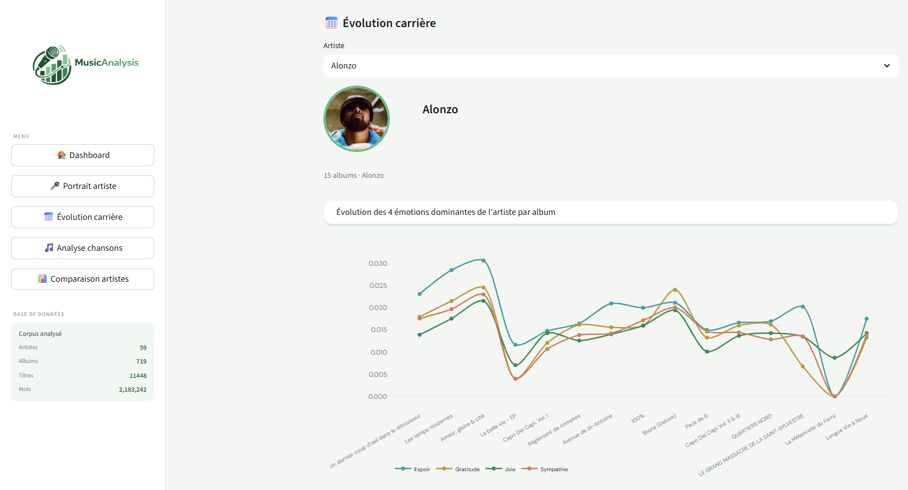
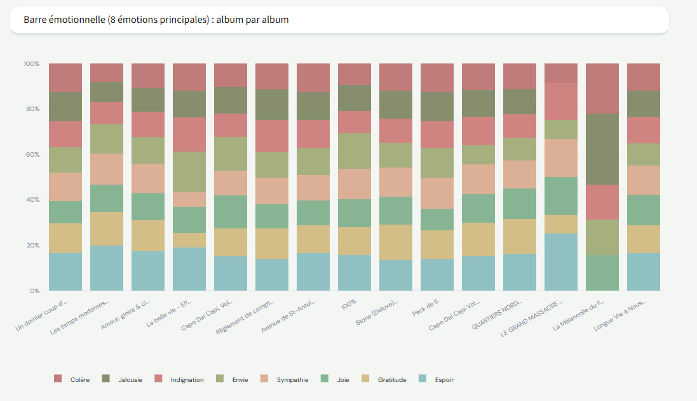
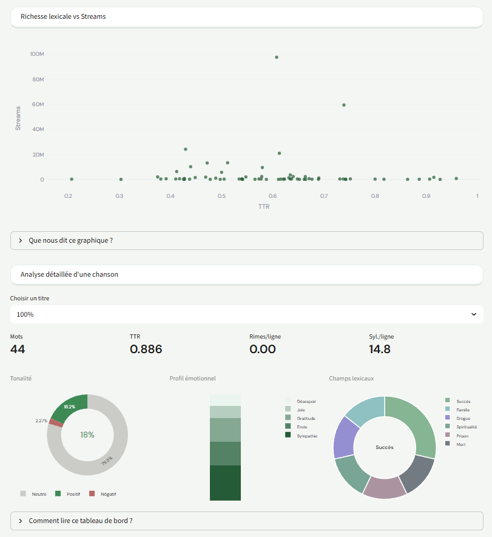
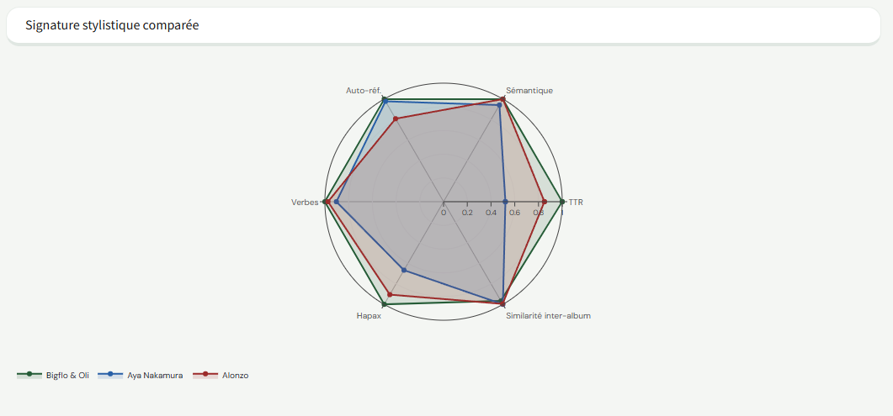
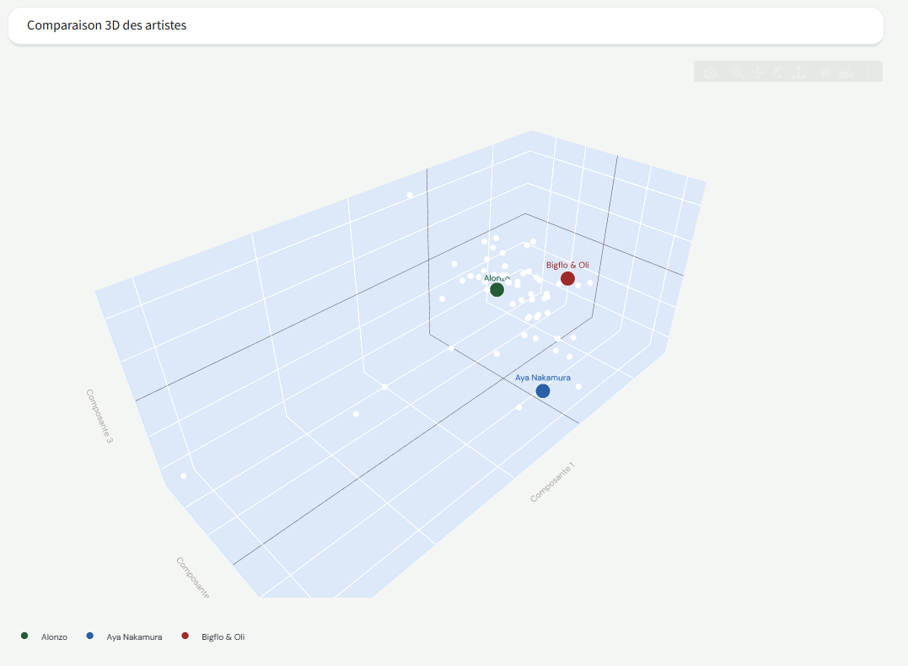

# 🎵 MusicAnalysis

Dashboard accessible sur ce [lien](https://musicanalysis-sgfaf6nfpuj2bxtxyyv9qv.streamlit.app/)




> Analyse de l'évolution musicale et lyricale des artistes francophones hip-hop / rap. Pipeline de collecte multi-sources → NLP → analyse audio → dashboard interactif.


---

## Table des matières

- [Problématique](#problématique)
- [Aperçu du dashboard](#aperçu-du-dashboard)
- [Architecture](#architecture)
- [Pipeline de collecte](#pipeline-de-collecte)
- [Stack technique](#stack-technique)
- [Structure du projet](#structure-du-projet)
- [Installation et lancement](#installation-et-lancement)
- [Lancer le pipeline complet](#lancer-le-pipeline-complet)
- [Ajouter un artiste](#ajouter-un-artiste)
- [Commandes utiles](#commandes-utiles)
- [Limitations connues](#limitations-connues)
- [Licence](#licence)

---

## Problématique

Le rap ainsi que le hip hop francophone sont les des genres musicaux les plus dynamiques et les plus documentés en termes de données (streams, paroles, discographies). Pourtant, très peu d'outils permettent d'en faire une lecture analytique structurée.

**Ce projet cherche à répondre à une question simple : comment évolue un artiste au fil de sa carrière, et qu'est-ce qui distingue réellement les univers lyricals entre eux ?**

Pour y répondre, MusicAnalysis agrège des données issues de quatre sources distinctes (Genius, Deezer, Spotify via Kworb, previews audio), les enrichit avec une couche NLP et une analyse audio, puis les restitue dans un dashboard conçu pour explorer ces données sans écrire une seule ligne de code.

Ce que l'on peut en retenir concrètement :

- Le vocabulaire ne prédit pas le succès commercial (TTR élevé ≠ streams élevés, cf. scatter plots)
- Les émotions dominantes d'un artiste sont remarquablement stables d'un album à l'autre
- Les artistes aux univers lyricals les plus proches ne sont pas toujours ceux qu'on attendrait
- L'analyse audio sur 30 secondes suffit à différencier des signatures sonores distinctes entre artistes

---

## Aperçu du dashboard









Les 5 vues disponibles :

| Vue | Description |
|---|---|
| 🏠 Dashboard | Vue globale du corpus : top artistes par vocabulaire carrière et par TTR, distribution des émotions, corrélation streams x richesse lexicale |
| 🎤 Portrait artiste | Fiche complète par artiste : carte d'identité stylistique, champs lexicaux, top mots, TF-IDF, émotions globales, empreinte sonore (radar), métriques stylométriques détaillées |
| 📈 Évolution carrière | Évolution des 4 émotions dominantes album par album, richesse lexicale au fil du temps, barre émotionnelle 100%, carte émotionnelle de la discographie |
| 🎵 Analyse chansons | Top titres par streams, albums les plus streamés, richesse lexicale vs streams, analyse détaillée par chanson (tonalité, profil émotionnel, champs lexicaux) |
| 📊 Comparaison artistes | Tableau comparatif, signature stylistique radar multi-artistes, comparaison 3D (PCA), comparaison des discographies TTR x streams |

---

## Architecture

```
┌─────────────────────────────────────────────────────────────────┐
│                         Sources brutes                          │
│   Genius (API)     Deezer (API)     Kworb (scraping)           │
│   Paroles + meta   ISRC + meta      Streams Spotify             │
│                    Previews 30s                                  │
└──────────┬─────────────┬───────────────────┬────────────────────┘
           │             │                   │
           ▼             ▼                   ▼
┌─────────────────────────────────────────────────────────────────┐
│                      flow.py  (CLI unifié)                      │
│                                                                 │
│  1. genius_explorer     Récupère artistes + paroles             │
│  2. deezer_enricher     Enrichit avec ISRC + métadonnées        │
│  3. samples_downloader  Télécharge previews audio 30s           │
│  4. merge_ranking       Fusionne avec les rankings externes     │
│  5. kworb_streams       Scrape streams Spotify via Kworb        │
│  6. audio_features      Analyse librosa des MP3 (BPM, énergie…) │
│  7. lyrics_analyzer     Pipeline NLP complet                    │
│  8. cleanup_samples     Supprime les MP3 (features déjà en BDD) │
└──────────────────────────────┬──────────────────────────────────┘
                               │
                               ▼
┌─────────────────────────────────────────────────────────────────┐
│                    DuckDB  music_analysis.duckdb                 │
│  tracks_flat   tracks_analysis   albums_analysis                │
│  artists_analysis   audio_features_local   kworb_streams        │
│  isrc_data   ranking_data   samples_index                       │
└──────────────────────────────┬──────────────────────────────────┘
                               │
                               ▼
┌─────────────────────────────────────────────────────────────────┐
│                   dashboard/ Streamlit (5 vues)                  │
└─────────────────────────────────────────────────────────────────┘
```

---

## Pipeline de collecte

La collecte des données est le cœur du projet. Quatre sources ont été croisées pour construire un dataset cohérent par artiste et par morceau.

**Étape 1 — Genius (paroles + métadonnées)**
L'API Genius est interrogée à partir d'une liste d'artistes définie dans `config.py`. Pour chaque artiste, le pipeline récupère la discographie complète ainsi que les paroles de chaque morceau.

**Étape 2 — Deezer (enrichissement ISRC)**
Les titres sont ensuite enrichis via l'API Deezer, qui fournit les ISRC (International Standard Recording Code) et d'autres métadonnées comme la durée, le BPM déclaré, ou le lien vers le preview audio 30 secondes.

**Étape 3 — Téléchargement des previews audio**
Les 30 secondes de preview MP3 exposées par Deezer sont téléchargées localement pour l'analyse audio. Ces fichiers sont supprimés automatiquement après extraction des features (étape 8).

**Étape 4 — Merge rankings**
Les données locales sont enrichies avec des données de classement externes.

**Étape 5 — Streams Spotify via Kworb**
L'ISRC permet d'identifier l'ID artiste Spotify, qui correspond à celui utilisé sur le site Kworb. Le pipeline scrape Kworb pour récupérer les données de streams cumulés Spotify par morceau.

**Étape 6 — Analyse audio (librosa)**
Les previews MP3 sont analysés avec librosa pour extraire des features acoustiques : BPM, énergie, centroïde spectral, zero-crossing rate, etc. Ces features sont ensuite normalisées en 6 dimensions affichées sous forme de radar dans le dashboard (Brillance, Puissance, Rapidité, Flow, Rugosité, Chaleur). Note : ces features sont calculées sur 30 secondes seulement, ce qui constitue un échantillon partiel du morceau.

**Étape 7 — Analyse NLP des paroles**
Pipeline NLP complet sur les paroles nettoyées :
- TTR (Type-Token Ratio) et richesse lexicale
- Analyse émotionnelle via NRCLex (18 émotions)
- Champs lexicaux thématiques (rue, famille, argent, violence, drogue...)
- Métriques stylométriques : ratio noms/verbes/adjectifs, densité de rimes, syllabes par ligne, ratio hapax, longueur moyenne des mots, auto-référence (ratio je/j')
- TF-IDF pour identifier les mots signature de chaque artiste
- Embeddings sémantiques (sentence-transformers) pour la comparaison 3D
- Accessibilité textuelle (textstat)

**Étape 8 — Nettoyage**
Les fichiers MP3 téléchargés sont supprimés automatiquement après l'analyse audio. Toutes les features sont persistées en base DuckDB.

---

## Stack technique

| Catégorie | Outil |
|---|---|
| Langage | Python 3.11 |
| Warehouse | DuckDB |
| Collecte paroles | Genius API (`lyricsgenius`) |
| Collecte audio/ISRC | Deezer API |
| Streams | Kworb (scraping via `requests` + `beautifulsoup4`) |
| Analyse audio | `librosa` |
| NLP | `spaCy`, `NRCLex`, `nltk`, `textstat`, `vaderSentiment`, `pyphen`, `pronouncing` |
| Embeddings | `sentence-transformers` |
| Normalisation texte | `unidecode`, `rapidfuzz` |
| Dashboard | Streamlit + Plotly |
| Orchestration | `flow.py` (CLI maison) |

---

## Structure du projet

```
MusicAnalysis/
├── dashboard/
│   ├── app.py                    # Point d'entrée Streamlit
│   ├── config.py                 # Paramètres du dashboard
│   ├── components/               # Composants UI réutilisables
│   ├── data/                     # Helpers accès DuckDB
│   └── pages/                    # Les 5 vues du dashboard
├── pipeline/
│   ├── analyse/
│   │   └── audio_features.py     # Extraction features librosa
│   ├── nlp/
│   │   ├── analyzers/            # Modules d'analyse NLP
│   │   ├── lyrics_analyzer.py    # Orchestrateur NLP
│   │   ├── models.py             # Modèles de données
│   │   ├── helpers.py
│   │   ├── database.py
│   │   └── config.py
│   └── sourcing/
│       ├── genius_explorer.py    # Collecte Genius
│       ├── deezer_enricher.py    # Enrichissement Deezer + ISRC
│       ├── samples_downloader.py # Téléchargement previews 30s
│       ├── merge_ranking.py      # Fusion rankings
│       └── kworb_streams.py      # Scraping streams Spotify
├── rapports/                     # Exports CSV d'audit générés par flow.py
├── data/
│   └── music_analysis.duckdb     # Warehouse DuckDB (non versionné)
├── flow.py                       # CLI unifié
├── .env                          # Clés API (non versionné)
├── .gitignore
├── requirements.txt
└── README.md
```

---

## Installation et lancement

### Prérequis

- Python 3.11+
- Clé API Genius (gratuite sur [genius.com/api-clients](https://genius.com/api-clients))
- Clé API Deezer (gratuite sur [developers.deezer.com](https://developers.deezer.com))
- Compte Spotify Developer pour l'accès à l'API (gratuit sur [developer.spotify.com](https://developer.spotify.com))
- ~2 GB d'espace disque temporaire pour les previews audio (supprimés automatiquement après analyse)

### Installation

```bash
git clone https://github.com/ton-username/MusicAnalysis.git
cd MusicAnalysis

python -m venv .venv
source .venv/bin/activate       # Linux / macOS
# .venv\Scripts\activate        # Windows

pip install -r requirements.txt
python -m spacy download fr_core_news_md
```

### Variables d'environnement

Crée un fichier `.env` à la racine :

```env
GENIUS_ACCESS_TOKEN=ton_token_genius
DEEZER_APP_ID=ton_app_id
DEEZER_SECRET=ton_secret
SPOTIFY_CLIENT_ID=ton_client_id
SPOTIFY_CLIENT_SECRET=ton_client_secret
```

### Lancer uniquement le dashboard (données déjà en base)

Si tu disposes d'un fichier `music_analysis.duckdb` déjà peuplé, tu peux lancer directement le dashboard sans relancer le pipeline :

```bash
streamlit run dashboard/app.py
```

Accessible sur `http://localhost:8501`.

---

## Lancer le pipeline complet

Le fichier `flow.py` orchestre l'intégralité du pipeline dans l'ordre logique des dépendances. Les artistes à analyser sont définis dans `pipeline/nlp/config.py`.

```bash
# Pipeline complet (toutes les étapes dans l'ordre)
python flow.py run

# Étapes individuelles
python flow.py genius      # Étape 1 : collecte Genius
python flow.py deezer      # Étape 2 : enrichissement Deezer + ISRC
python flow.py samples     # Étape 3 : téléchargement previews audio
python flow.py ranking     # Étape 4 : merge rankings
python flow.py streams     # Étape 5 : streams Spotify via Kworb
python flow.py audio       # Étape 6 : analyse audio librosa
python flow.py nlp         # Étape 7 : analyse NLP des paroles
python flow.py cleanup     # Étape 8 : suppression des MP3

# Outils d'audit
python flow.py audit       # Export CSV de toutes les tables pour vérification
python flow.py schema      # Export du schéma complet de la BDD
python flow.py query "SELECT COUNT(*) FROM tracks_flat"
```

---

## Ajouter un artiste

Le corpus initial couvre 59 artistes francophones hip-hop / rap. Il est extensible : ouvre `pipeline/nlp/config.py` et ajoute le nom de l'artiste à la liste `ARTISTS`.

```python
ARTISTS = [
    "Alonzo",
    "Booba",
    # ... ajoute ici
    "Nouvel Artiste",
]
```

Ensuite, relance les étapes depuis le début pour le nouvel artiste :

```bash
python flow.py run
```

**Important** : le pipeline est optimisé pour le rap francophone, notamment pour le nettoyage des paroles avant l'entraînement NLP (argot, verlan, termes spécifiques au genre). Les résultats seront dégradés pour des artistes hors de ce périmètre.

Pour supprimer un artiste de la base :

```bash
python flow.py delete "Nom Artiste"
```

---

## Commandes utiles

```bash
# Inspecter le schéma de toutes les tables
python flow.py schema

# Exécuter une requête SQL arbitraire sur la base
python flow.py query "SELECT artist_name, COUNT(*) FROM tracks_flat GROUP BY 1 ORDER BY 2 DESC"

# Générer les rapports d'audit CSV (un fichier par table)
python flow.py audit
```

---

## Limitations connues

Ces limitations sont documentées volontairement.

**Analyse audio sur échantillon partiel**
Les features audio (Brillance, Puissance, Rapidité, Flow, Rugosité, Chaleur) sont calculées à partir des 30 secondes de preview exposées par l'API Deezer. Cet échantillon ne représente pas toujours la structure complète du morceau (intro, hook, outro exclus selon la position du preview).

**Qualité des paroles Genius**
Les paroles issues de Genius sont contributives : certains titres contiennent des erreurs de transcription, des paroles incomplètes, ou des annotations non filtrées. Un nettoyage est appliqué mais ne couvre pas tous les cas.

**Correspondances ISRC manquantes**
La jointure entre Genius et Deezer repose sur le titre et l'artiste. Environ 5 à 10% des morceaux ne trouvent pas de correspondance ISRC, ce qui les exclut de l'analyse audio et des streams.

**Scraping Kworb**
La récupération des streams Spotify passe par le scraping du site Kworb. Ce mécanisme peut se rompre si le site modifie sa structure HTML.

**Rate limits des APIs**
Les APIs Genius et Deezer imposent des limites de requêtes. Sur un corpus de 59 artistes (11 000+ titres), le pipeline complet prend plusieurs heures. Des délais sont intégrés dans le code mais une interruption réseau peut nécessiter une reprise manuelle depuis l'étape concernée.

**Périmètre linguistique et stylistique**
Le pipeline NLP est calibré pour le rap francophone : liste de stopwords, nettoyage du verlan, détection des champs lexicaux. Les artistes en dehors de ce périmètre (chanson française, rap anglophone, pop) produiront des métriques moins fiables.

**Modèle global vs spécificité par artiste**
L'analyse émotionnelle (NRCLex) et les champs lexicaux sont calculés avec des modèles génériques. Un modèle fine-tuné sur le corpus rap francophone améliorerait probablement la précision de ces analyses.

---

## Licence

MIT — voir [LICENSE](LICENSE)
